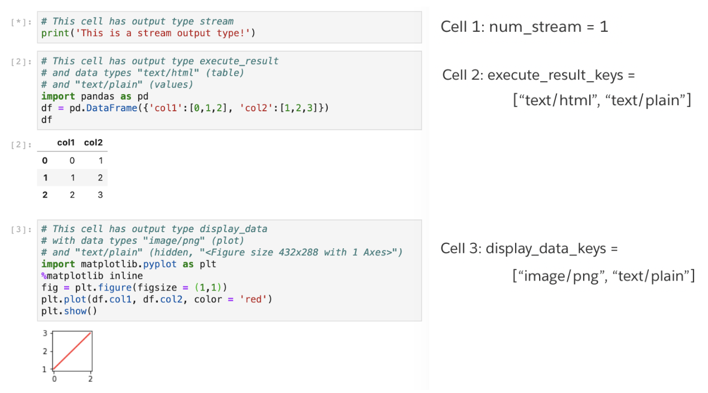
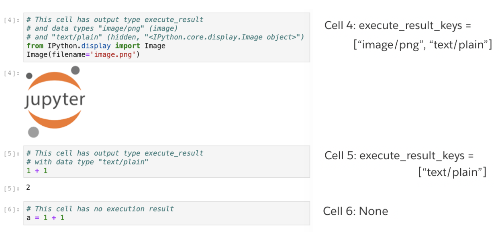

# Collaboration Instructions
## How to access, use, and interpret our datasets

* * *

## Data Access

Create an AWS account and request read access to the `jupyter-notebook-data` S3 bucket. The final data is stored in the `csv_final` directory. Completed aggregations on the cells dataset that are used in the analysis notebooks can be found in the `analysis_data` directory. Make sure your machine is set up with your AWS credentials (see [AWS Command Line Interface User Guide](https://docs.aws.amazon.com/cli/latest/userguide/cli-chap-welcome.html)) and run `aws s3 ls jupyter-notebook-data` to check that access has been granted.

Individual files can be downloaded with the command line interface. Note that `cells.csv` is nearly 80 GB, so you must have adequate storage on your device and it may take some time to copy down from the bucket.

```
aws s3 cp s3://jupyter-notebook-data/csv_final/repos.csv
```

Alternatively, to download CSV files with a Python script, you can use [boto3](https://boto3.amazonaws.com/v1/documentation/api/latest/index.html?id=docs_gateway), the AWS SDK for Python. Below is an example of how to download the cells dataset.

```
import boto3
s3 = boto3.resource('s3')
s3.meta.client.download_file(
    'jupyter-notebook-data',          # bucket name
    'csv_final/cells.csv',            # file key
    '/Users/me/csv_final/cells.csv'.  # local path
)
```

* * *

## Data Use

Once the files are downloaded from S3, the notebooks, repos, and owners CSVs are small enough to open with the `read_csv` function from python. 

```
repos = pd.read_csv('csv_final/repos.csv')
owners = pd.read_csv('csv_final/owners.csv')
notebooks = pd.read_csv('csv_final/notebooks.csv')
```

However, the cells dataset is nearly 80 gigabytes and will cause a MemoryError. I have handled this using the `chunksize` argument, processing local aggregations, and then concatenating the results. If the result of local aggregations is one row per notebook, another aggregation is needed after concatenating for the case where the cells of a notebook was split across multiple chunks. Employing the `usecols` parameter to only load selected columns can also save some memory.

```
# Create chunks generator.
df_chunks = pd.read_csv(
    'csv_final/cells.csv', 
    header = 0, 
    usecols = ['file','cell_id','cell_type'], 
    chunksize = 10000
)

cells_aggregated_dfs = []

# Each chunk is a dataframe with 
# the selected columns.
for chunk in df_chunks:
    # Find the number of each cell type
    # in a notebook.
    df = chunk.groupby(
        ['file', 'cell_type']
    )['cell_id'].count().reset_index().pivot(        
        index = 'file', 
        columns = 'cell_type', 
        values = 'cell_id'
    ).reset_index().fillna(0)
    
    # Store chunk aggregation.
    cells_aggregated_dfs.append(df)
    
# Concatenate data frames and combine.
cells_aggregated_df = pd.concat(
    cells_aggregated_dfs, 
    sort = False
).groupby('file')[[
    'code','markdown'
]].sum().reset_index()

```

* * *

## Data Set Descriptions

### cells.csv

* cell_id: Reflects the order of cells in a notebook.
* cell_type: Mostly markdown or code, also includes raw. There are other cell types that were used in old notebook formats (current notebooks have nbformat4). *Heading* cells should be included in any *markdown* cell analysis.
* classes: List of classes defined in a code cell. Each class is a list in the format [class_name, num_methods, num_attributes].
* code: List of lines of code.
* display_data_keys: List of display keys. Examples of display keys include “text/html”, “text/plain”, “image/png”, “text/markdown”, etc.
* error_names: List of errors. Examples of error names include “ImportError”, “RuntimeError”, “SyntaxError”, etc.
* error_values: List of error messages. Examples of error messages include “no module named Numpy”, “not readable”, etc.
* execute_result_keys: List of output data types.
* execution_count: Reflects the order cells were ran in a notebook.
* file: Filename.
* functions: List of functions defined in a code cell. Each function is a list in the format [function_name, num_arguments].
* headings: List of headings in a markdown cell. Each heading is a list in the format [level, text].
* imports: List of imports in a code cell. Each import is a list in the format [package, alias].
* lines_of_code: Number of lines of code in a code cell.
* links: List of links in a markdown cell.
* markdown: List of lines of markdown.
* num_classes: Number of classes defined in a code cell.
* num_comments: Number of comments in a code cell.
* num_display_data: Number of displayed data objects from a code cell.
* num_error: Number of errors caused by the cell.
* num_execute_result: Number of execution result objects from a code cell.
* num_functions: Number of functions defined.
* num_imports: Number of imports.
* num_stream: Number of stream (e.g. print) outputs.
* num_words: Number of markdown words.

**Notes:**

* To get a better idea of what display_data_keys versus execute_result_keys, here are some clarifying examples.






### notebooks.csv

* file: File name.
* kernel_lang: Language of the specified kernel.
* kernel_name: Name of the specified kernel.
* lang_name: Language name of the notebook.
* lang_version: Language version of the notebook.
* nbformat: Format (version) of the notebook. Current nbformat is 4.
* nbformat_minor: Minor version of the notebook.
* num_cells: Number of cells in the notebook.
* days_since: Number of days since the start of the downloading process that this notebook was downloaded. Not to be used in analysis, only used for sorting in download.py.
* filesize: File size range query that the notebook was found in.
* html_url: URL to locate original notebook.
* name: Notebook name.
* owner_id: GitHub owner id.
* path: Direct path to notebook.
* query_page: What page of the query the notebook was found in. Not to be used in analysis.
* repo_id: GitHub repository id.

### repos.csv

* repo_id: GitHub repository id.
* owner_id: GitHub owner id.
* repo_description: GitHub repository description.
* repo_html_url: URL to locate repository.
* repo_name: Name of repository.
* created_at: Date at which the repository was created.
* fork: Whether repository was forked from another. Will always be False.
* forks_count: Number of forks this repository has.
* has_downloads: Whether downloads are enabled for this repository.
* has_issues: Whether issues are enabled for this repository.
* has_pages: Whether pages are enabled for this repository.
* has_wiki: Whether wiki is enabled for this repository.
* language: Primary language of the repository.
* open_issues_count: Number of open issues.
* pushed_at: Date at which the user most recently pushed to the repository.
* size: Size of the repository. 
* stargazers_count: Number of stargazers.
* subscribers_count: Number of subscribers.
* updated_at: Date at which the user most recently updated the repository. An “update” can include more than new code (it also looks at if language has changed, if there's a new stargazer, if a contributor has been added, etc). This isn't always related to file updates
* watchers_count: Number of watchers.

**Notes**

* In 2012, GitHub changed what “watchers”, “stargazers”, and “subscribers” mean. All three variables are recorded here, though not all are useful in all situations. Source: https://developer.github.com/changes/2012-09-05-watcher-api/.

### owners.csv

* owner_id: GitHub owner id.
* owner_html_url: URL to locate owner GitHub profile.
* owner_login: Owner login name.
* type: Whether owner is an organization or user.

