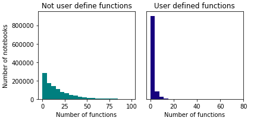
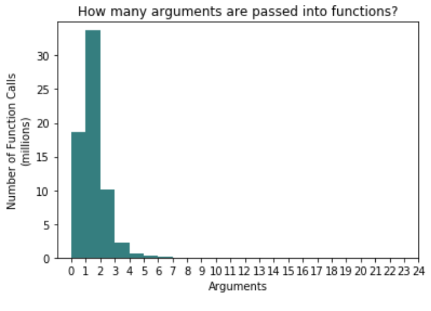
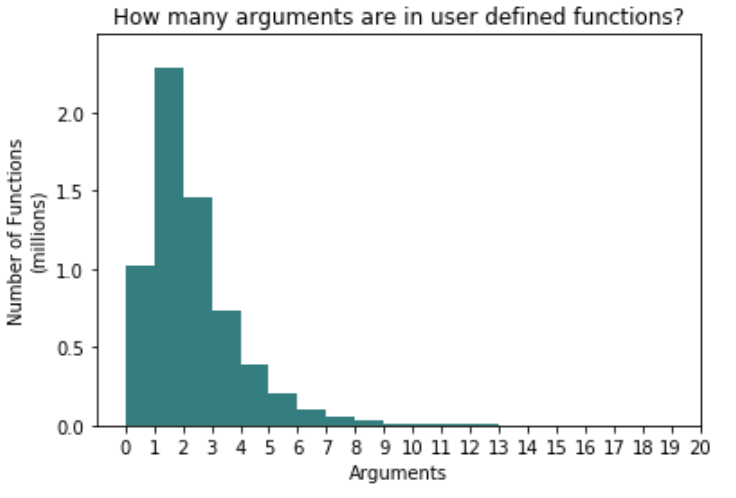

# API Design

There are a lot of different ways of spelling out functionality in APIs. Some of them are painful, while others are highly usable. We may be able to learn things about API design by looking at what APIs people are using and how. One goal here is to design good APIs by advising the granularity questions (lots of small objects/functions, or a few with lots or arguments)?

Notebook errors are a good indicator of what users struggle with. However, its important to keep in mind that many users will take care of errors before posting a notebook publicly to GitHub. It's likely that most struggles faced by users are not visible to us in the end product of their notebook. Here, I investigate the frequency and types of errors as well as the relationship between number of errors and a variety of other factors, including educational status, amount of markdown text, and whether the notebook cells were run in order.

## Methods

For this research, we narrow our focus to notebooks written in Python. More specifically, for inspection of functions and objects, we only consider notebooks that were able to be parsed with the Python abstract syntax tree (ast) package. Only 73.23% of Python 3 notebooks were able to be parsed. A notebook is unable to be parsed if there is a syntax error in any of its code cells. Some notebooks were unable to be parsed because of errors in translating strings from the way they are stored in the JSON files to how they were stored in our database. The section on Errors does not exclude these notebooks, as Python AST was not used to extract information on Errors.

## Functions

*Figure 1: Number of functions, user defined vs not user defined.*

The median number of user defined functions used in a notebook is 0 while the number of not user defined functions is centered at 19. The distribution for not user defined functions is more right-skewed than that for user defined functions.

*Figure 2: parameters per function call*

*Figure 3: parameters per function definition*

Across all function calls, there are an average of 0.99 arguments per function. Figure 2 shows that the distributions of parameters per function call is centered at 1 and slightly skewed right, but tapers off very quickly. A function definition, on the other hand, has an average of 1.94 parameters. Figure 3 shows that this distribution is centered around 2 and more right skewed.

## Objects

On average, among notebooks that were able to be parsed with they Python abstract syntax tree, there are 20.72 objects defined in a notebook (median = 13). Narrowing this down to only notebooks with at least one object, the median increases to 14 objects.

## Errors

11.77% of notebooks have at least one error. The most common errors are NameErrors, TypeErrors, and ValueErrors. Errors are more common in notebooks that were run out of order. We are 95% confident that notebooks run out of order have between 0.25 and 0.56 more errors than notebooks run in order (Observed averages 2.1 and 1.69 errors, respectively). I also found that errors are more common among notebooks not using machine learning frameworks (95% confidence interval of between 0.10 and 0.39 less errors in notebooks using Keras, Tensorflow, or Scikit-Learn).

I did not find any associations between errors and the amount of markdown, whether the notebook is educational, or the repository’s level of collaboration. I also didn’t find associations with the number of functions defined or used in a notebook, nor with the average number of parameters of functions in a notebook.
