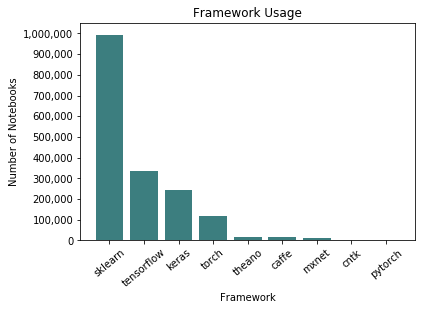
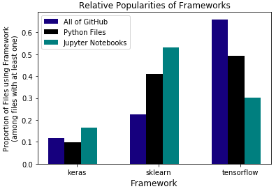
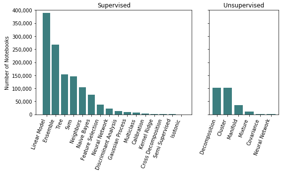
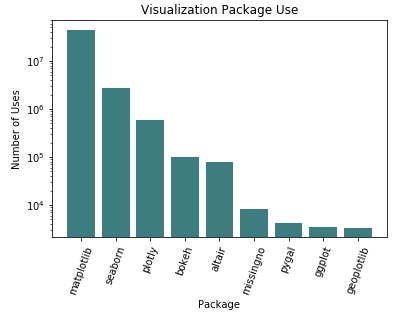
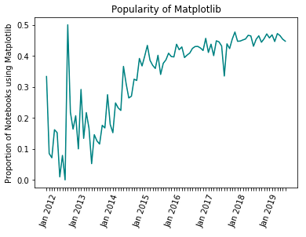
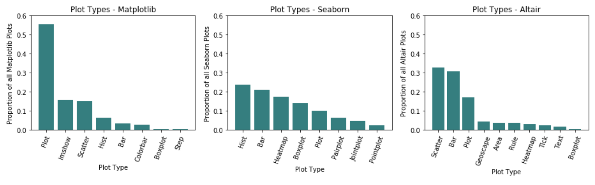

# Data Science with Jupyter

## Machine Learning Framework Use

The machine learning framework used in a project determines how the data must be formatted, what other packages need to be imported, what kinds of models are accessible, and how long the model will take to train. Here, I look at what frameworks are used—and what they are used for—in Jupyter notebooks to get a better understanding of the users and their processes.cd 

Popular machine learning frameworks for Python considered in this research are Theano, Scikit-Learn, Tensorflow, Keras, PyTorch, Torch, Caffe, Keras, CNTK, MXnet. In articles, books, and blog posts, data scientists debate over which framework is the best and in what contexts. In quick scans of dozens of these discussions, I saw Tensorflow referred to as the “undisputed heavyweight champion” (Hale) and “arguably the most popular Deep Learning framework today” (Kharkovyna). Other sources report that PyTorch is “the framework of choice for a large number of researchers” (Opala, Deep Learning Frameworks Comparison). Scikit-Learn was rarely referred to, and was talked about in the context of smaller data science projects and simple exploratory models. One article referred to Scikit-learn as “easy to use even for beginners — and a great choice for simpler data analysis tasks. On the other hand, scikit-learn is not the best choice for deep learning” (Opala, Top Machine Learning Frameworks Compared). In the O’Reilly book *Hands on Machine Learning with Scikit-Learn and Tensorflow*, author Aurélien Géron refers to Scikit-Learn as “very easy to use, yet implements many Machine Learning algorithms efficiently, so makes for a great entry point to learn Machine Learning”. In contrast, he says that Tensorflow “is a more complex library...[that] makes it possible to train and run very large neural networks efficiently”.  Even Scikit-Learn’s documentation for neural network models warns, “This implementation is not intended for large-scale applications. In particular, Scikit-Learn offers no GPU support.” with a link to related projects to use instead.

Scikit-Learn is the most popular framework in Jupyter notebooks. Tensorflow, Keras, and Torch are up there as well, but  much less popular than Scikit-Learn. Theano, Caffe, Mxnet, CNTK, and PyTorch are used very rarely.

*Figure 1. Popularities of Machine Learning Frameworks in public Jupyter Notebooks on GitHub.*

This does not match the popularity distribution across all file types on GitHub. Consider the relative popularities of Scikit-Learn, Tensorflow, and Keras within public Jupyter notebooks compared to all public code on GitHub. Note that these numbers were collected from GitHub code searches for each framework with the specified file type. Files with “sklearn” in a comment or in a markdown cell are counted, even if the framework was never imported or used. Among notebooks *referencing* at least one of the three machine learning frameworks, 70.01% use Scikit-Learn, 39.84% use Tensorflow, and 21.69% use Keras. However, among *all* code files on GitHub referencing at least one of the three frameworks, only 24.78% use Scikit-Learn, 72.86% use Tensorflow, and 12.84% use Keras.

My initial suspicion was that this was simply because Tensorflow has more language options. There are nearly 3 million code results for “tensorflow” in C++, while Keras and Scikit-Learn are almost entirely used in Python or Jupyter notebook files. Though not as dramatic, the difference in distributions is still present when we compare relative popularities in Jupyter notebooks to that in Python files (see Figure 2). A Chi-Squared test for independence of file type and framework results in a p-value less than 0.0001, providing strong evidence that there is an association between file type and framework use.

*Figure 2: Relative Popularities of Frameworks, public Python files versus public Jupyter notebooks on GitHub.*

### Discussion

A possible explanation for the substantial difference in framework popularities across file types is that introductory machine learning and data science courses frequently teach SciKit-Learn in conjunction with Jupyter notebooks, so beginner projects on GitHub may use both often.

Another option is that people are using non-modeling functions from SciKitLearn, such as pre-processing functions and sample datasets, and they are doing so more often in Jupyter notebooks than in Python files.

A final explanation is that while Jupyter notebooks are very well suited for quick-running, iterative, presentation-style data science, they are less popular for production level projects. Scikit-Learn is a quick modeling library that beginners can use with ease, so it makes sense that these things would be used together. If Tensorflow is more frequently used for large scale projects, notebooks may not be the file type of choice for those developers. 

## Types of Models Used

In general, machine learning models can be split up into *supervised* and *unsupervised* learning, and models are chosen depending on the type of problem and the data available. Further, there are various algorithms within the unsupervised (e.g. k-means clustering and principal component analysis) and supervised (e.g. support vector machines, regression, and naive Bayes) categories.

The way the Scikit-Learn framework is built makes it very easy to figure out what types of models users are employing (all models follow the naming system of sklearn.model_name). For this reason, and because Scikit-Learn is the most frequently used framework within Jupyter notebooks, I have investigated model use only looking at Scikit-Learn models within notebooks written in Python.

Users are most frequently employing supervised learning models. The most common of these is linear model, which includes ordinary least squares, ridge regression, lasso, elastic net, bayesian regression, logistic regression, stochastic gradient descent, and a number of other variations. Among unsupervised models, the most popular is decomposition. This includes algorithms like principal component analysis and factor analysis. Decomposition is closely followed by clustering, which includes K means, DBSCAN, and other clustering algorithms. (Scikit-Learn documentation, API Reference).

*Figure 3: Use of SciKit-Learn models, supervised versus unsupervised.*

## Visualization Packages Use

Visualizations are extremely important in data science to clearly and accurately display results. In Jupyter notebooks, Matplotlib is the most frequently used visualization tool, over 10 times more frequent than Seaborn, the next most popular. The proportion of notebooks that use Matplotlib had high variation between 2012 and 2013, likely due to the small number of notebooks. The popularity has grown dramatically from about 10% in June 2013 and looks to be converging to about 42% of all notebooks importing Matplotlib. On average, there are 5.1 Matplotlib visualizations per notebook.  

*Figure 4: Use of Python visualization packages.*

*Figure 5. Matplotlib over time.*

In Packages.ipynb I discovered a strong association rule from Seaborn to Matplotlib, with the packages imported together in 10% of notebooks, and a 94% chance of Matplotlib being imported into a notebook given that Seaborn is imported. While Matplotlib is frequently imported and used without Seaborn (76% of its use cases), Seaborn is only used in isolation from Matplotlib in 6% of its use cases. This implies that the use of Seaborn may not be self-sufficient; users may use Matplotlib to use in conjunction with Seaborn or to make up for what Seaborn cannot do.

## Types of Visualizations Used

An interesting discovery is that the top two visualization packages tend to be used for different types of plots. While Matplotlib is more likely to be used for two-variable visualizations with line graphs, scatterplots, and heat maps, Seaborn is more likely to be used for univariate display with histograms, bar plots, and box plots. Altair, on the other hand, has approximately equal uses of scatterplots and bar plots.

*Figure 6: Plot types, Matplotlib versus Seaborn.*

Labeling plots with titles, axis labels, and legends is useful in giving readers context, an important part in creating a computational narrative. Assuming that each occurrence of a “plot type” command (hist, scatter, plot, etc.) is one plot, I looked into the frequency of title, axis label, and legend commands in comparison. Looking only at Matplotlib plots, titles are used on 33%, x and y labels each on 29%, and legends on 17%. From this, it seems like the majority of plots in Jupyter notebooks do not provide context.

## Sources

1. Géron, Aurélien. *Hands-On Machine Learning with Scikit-Learn & TensorFlow: concepts, tools, and techniques to build intelligent systems*. March 2017. 
2. Hale, Jeff. *Which Deep Learning Framework is Growing Fastest*. 1 April 2019. https://towardsdatascience.com/which-deep-learning-framework-is-growing-fastest-3f77f14aa318.
3. Kharkovyna, Oleksii. *Top 10 Bet Deep Learning Frameworks in 2019*. 3 June 2019. https://towardsdatascience.com/top-10-best-deep-learning-frameworks-in-2019-5ccb90ea6de.
4. Opala, Mateusz. *Deep Learning Framework Comparison - Tensorflow, PyTorch, Keras, MXNet, The Microsoft Cognitive Toolkit, Caffe, Deeplearning4j, Chainer*. 6 September 2018. https://www.netguru.com/blog/deep-learning-frameworks-comparison.
5. Opala, Mateusz. *Top Machine Learning Frameworks Compared: Scikit-Learn, Dlib, Mlib, Tensorflow, and More*. https://www.netguru.com/blog/top-machine-learning-frameworks-compared.
6. Reddit. *Which in your opinion is the best ML framework? *12 July 2018. https://www.reddit.com/r/MachineLearning/comments/8yadqh/d_which_in_your_opinion_is_the_best_ml_framework/.
7. Scikit-Learn. API Reference. https://scikit-learn.org/stable/modules/classes.html#api-reference.
8. Scikit-Learn. Neural Network Models (supervised). https://scikit-learn.org/stable/modules/neural_networks_supervised.html.

